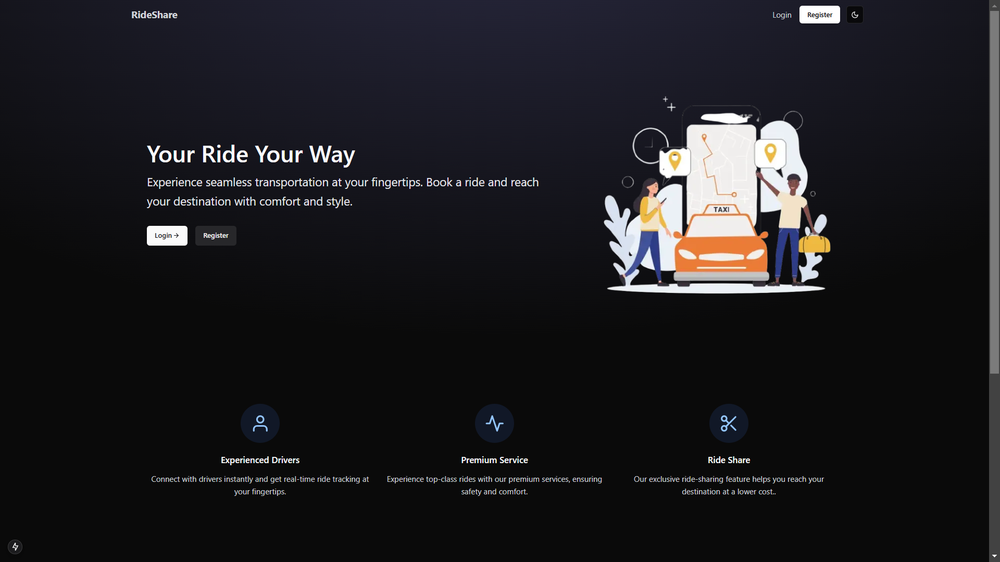

#  RideShare – Your Ride Your Way

Experience seamless transportation at your fingertips. Book a ride and reach your destination with comfort and style.

[](https://nextjs.org/)
[](https://tailwindcss.com/)
[](https://www.typescriptlang.org/)
[](https://ui.shadcn.com/)




## 🚀 Quick Start

1. Install dependencies:
```bash
npm install
```

2. Start the development server:
```bash
npm run dev
```

3. Open [http://localhost:3000](http://localhost:3000) to view your site


## ✨ Features

- 🎨 **Modern Design System**: Built on top of shadcn/ui, offering a clean and professional look
- 📱 **Fully Responsive**: All components work perfectly across desktop, tablet, and mobile devices
- ⚡ **Performance Optimized**: Leverages React.js features for optimal loading speed
- 🌗 **Dark Mode Support**: Seamless light/dark mode switching with system preference detection
- 🎯 **SEO Optimized**: Built with best practices for search engine visibility


## 🛠️ Tech Stack

- **Framework**: [Next.js](https://nextjs.org/)
- **Styling**: [Tailwind CSS](https://tailwindcss.com/)
- **UI Components**: [shadcn/ui](https://ui.shadcn.com/)
- **Language**: [TypeScript](https://www.typescriptlang.org/)
- **Animations**: CSS animations and transitions
- **Icons**: Lucide icons


<p align="center">
  <a href="/">Website</a> 
</p>
